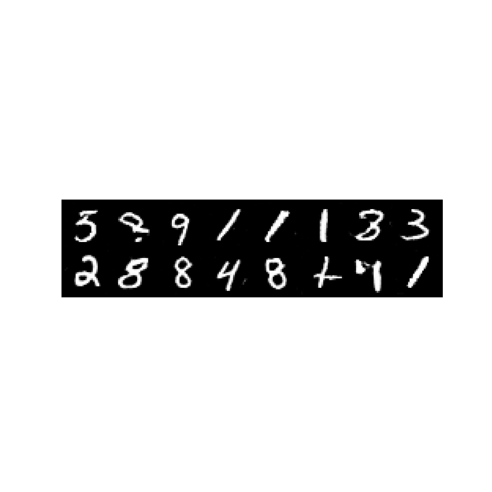
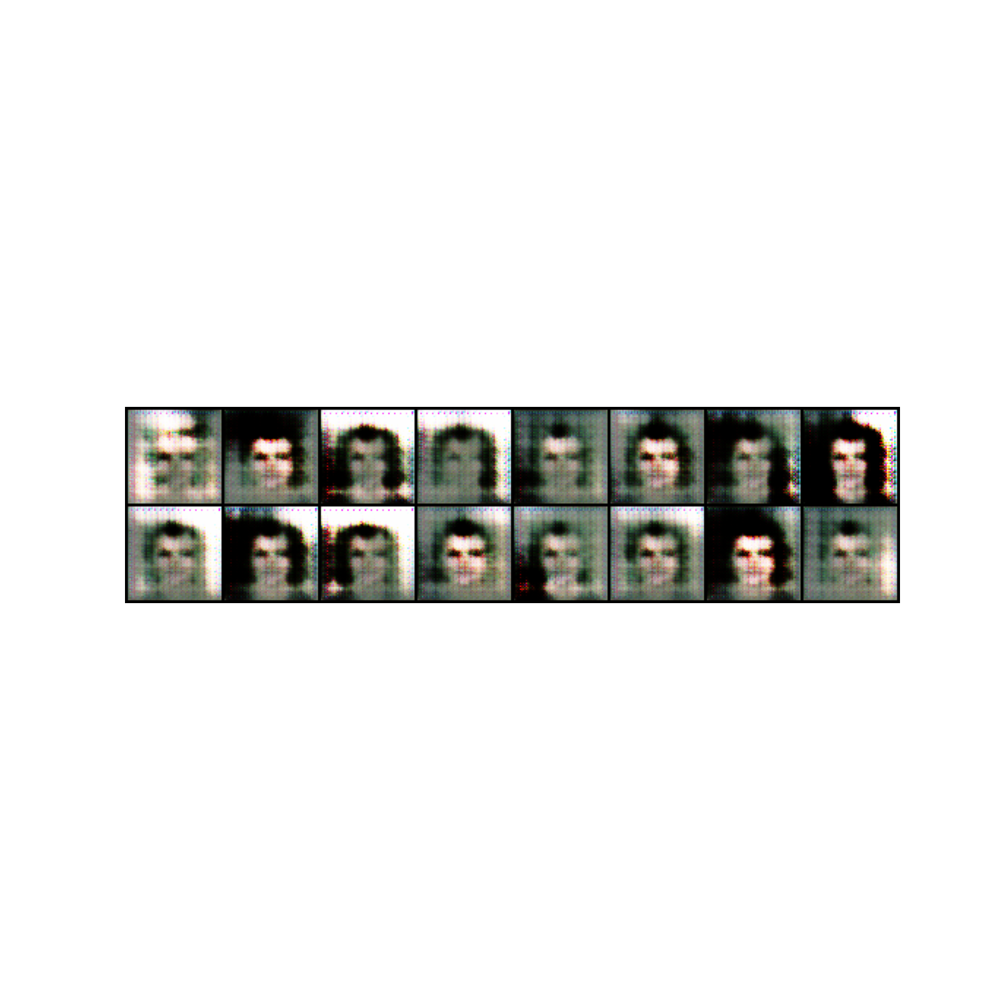

# DCGAN for various dataset

## Installation

Install `pip ` packages

```bash
pip install -r requirements.txt
```

## Models

The trained model is present in the folder `./models/final/generator.pt`.

## Dataset

Create a directory called `dataset` in the root folder. Pytorch dataset class will download the MNIST dataset while training.


## Training
```bash
python main.py train --config /path_to_config_file
```

## Result
All the intermediate output can be found at `./data/images/DCGAN/dataset_name/`

## Configurations
Any config setting can be found in `./config.yaml` file.

## Sample MNIST output after 30 epochs


## Sample CELEB output after 10 epochs
